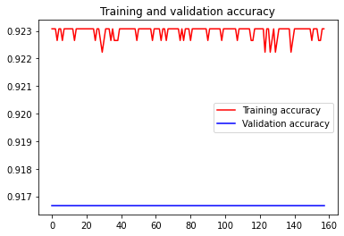

**Import Packages**


```python
import os
import numpy as np # linear algebra
import pandas as pd # data processing, CSV file I/O (e.g. pd.read_csv)
import matplotlib.pyplot as plt
import matplotlib.image as mpimg
%matplotlib inline

import tensorflow as tf
from tensorflow.keras.preprocessing.image import ImageDataGenerator
from tensorflow.keras.preprocessing.image import img_to_array, load_img
from tensorflow.keras.optimizers import RMSprop

import random
base_dir='../input/defect-imageset'
train_dir = os.path.join(base_dir, 'train')
validation_dir = os.path.join(base_dir, 'valid')
```

**Explore the Data**


```python
train_B_MD_Line = os.path.join(train_dir, 'B_MD Line')
train_Bright = os.path.join(train_dir, 'Bright')
train_Coating = os.path.join(train_dir, 'Coating')
train_D_MD_Line = os.path.join(train_dir, 'D_MD Line')
train_Dark = os.path.join(train_dir, 'Dark')
train_Dent = os.path.join(train_dir, 'Dent')
train_Insect = os.path.join(train_dir, 'Insect')
train_Pass_G_Film = os.path.join(train_dir, 'Pass_G_Film')
train_Pass_Glue = os.path.join(train_dir, 'Pass_Glue')
train_Pass_W_Film = os.path.join(train_dir, 'Pass_W_Film')
train_Scratch = os.path.join(train_dir, 'Scratch')
train_Substance = os.path.join(train_dir, 'Substance')
train_Uncoating = os.path.join(train_dir, 'Uncoating')
```


```python
validation_dir_B_MD_Line = os.path.join(validation_dir, 'B_MD Line')
validation_dir_Bright = os.path.join(validation_dir, 'Bright')
validation_dir_D_MD_Line = os.path.join(validation_dir, 'D_MD Line')
validation_dir_Dark = os.path.join(validation_dir, 'Dark')
validation_dir_Dent = os.path.join(validation_dir, 'Dent_RGH')
validation_dir_Insect = os.path.join(validation_dir, 'Insect')
validation_dir_Pass_G_Film = os.path.join(validation_dir, 'Pass_G_Film')
validation_dir_Pass_Glue = os.path.join(validation_dir, 'Pass_Glue')
validation_dir_Pass_W_Film = os.path.join(validation_dir, 'Pass_W_Film')
validation_dir_Scratch = os.path.join(validation_dir, 'Scratch')
validation_dir_Substance = os.path.join(validation_dir, 'Substance')
validation_dir_Uncoating = os.path.join(train_dir, 'Uncoating')
```

**Data Preprocessing**


```python
train_datagen = ImageDataGenerator(rescale=1.0/255,
                                  rotation_range=40,
                                  width_shift_range=0.2,
                                  height_shift_range=0.2,
                                  shear_range=0.2,
                                  zoom_range=0.2,
                                  horizontal_flip=True,
                                  fill_mode='nearest')
test_datagen = ImageDataGenerator(rescale=1.0/255)
```


```python
train_generator = train_datagen.flow_from_directory(train_dir,batch_size=20,class_mode='categorical',target_size=(150,150))
validation_generator = test_datagen.flow_from_directory(validation_dir,batch_size=20,class_mode='categorical',target_size=(150,150))
```

    Found 15858 images belonging to 13 classes.
    Found 1718 images belonging to 12 classes.
    

**Building Model**


```python
model=tf.keras.models.Sequential([
    tf.keras.layers.Conv2D(16, (3,3), activation='relu',input_shape=(150,150,3)),
    tf.keras.layers.MaxPooling2D(2,2),
    tf.keras.layers.Conv2D(32, (3,3), activation='relu'),
    tf.keras.layers.MaxPooling2D(2,2),
    tf.keras.layers.Conv2D(64, (3,3), activation='relu'),
    tf.keras.layers.MaxPooling2D(2,2),
    tf.keras.layers.Flatten(),
    tf.keras.layers.Dense(1024, activation='relu'),
    tf.keras.layers.Dense(1,activation='sigmoid')    
])
```


```python
model.compile(optimizer=RMSprop(lr=0.001),
              loss='categorical_crossentropy',
              metrics=['acc'])
```

**Training**


```python

history=model.fit_generator(train_generator,
                           validation_data=validation_generator,
                           steps_per_epoch=100,
                           epochs=158,
                           validation_steps=50,
                           verbose=1)


model.save("rps.h5")
```

    Epoch 1/158
    100/100 [==============================] - 47s 467ms/step - loss: 1.1921e-07 - acc: 0.9231 - val_loss: 1.1921e-07 - val_acc: 0.9167
    Epoch 2/158
    100/100 [==============================] - 46s 460ms/step - loss: 1.1921e-07 - acc: 0.9231 - val_loss: 1.1921e-07 - val_acc: 0.9167
    Epoch 3/158
    100/100 [==============================] - 47s 466ms/step - loss: 1.1921e-07 - acc: 0.9231 - val_loss: 1.1921e-07 - val_acc: 0.9167
    Epoch 4/158
    100/100 [==============================] - 46s 462ms/step - loss: 1.1921e-07 - acc: 0.9227 - val_loss: 1.1921e-07 - val_acc: 0.9167
    Epoch 5/158
    100/100 [==============================] - 46s 463ms/step - loss: 1.1921e-07 - acc: 0.9231 - val_loss: 1.1921e-07 - val_acc: 0.9167
    Epoch 6/158
    100/100 [==============================] - 47s 465ms/step - loss: 1.1921e-07 - acc: 0.9231 - val_loss: 1.1921e-07 - val_acc: 0.9167
    Epoch 7/158
    100/100 [==============================] - 59s 589ms/step - loss: 1.1921e-07 - acc: 0.9227 - val_loss: 1.1921e-07 - val_acc: 0.9167
    Epoch 8/158
    100/100 [==============================] - 47s 472ms/step - loss: 1.1921e-07 - acc: 0.9231 - val_loss: 1.1921e-07 - val_acc: 0.9167
    Epoch 9/158
    100/100 [==============================] - 46s 464ms/step - loss: 1.1921e-07 - acc: 0.9231 - val_loss: 1.1921e-07 - val_acc: 0.9167
    Epoch 10/158
    100/100 [==============================] - 46s 464ms/step - loss: 1.1921e-07 - acc: 0.9231 - val_loss: 1.1921e-07 - val_acc: 0.9167
    Epoch 11/158
    100/100 [==============================] - 46s 463ms/step - loss: 1.1921e-07 - acc: 0.9231 - val_loss: 1.1921e-07 - val_acc: 0.9167
    Epoch 12/158
    100/100 [==============================] - 46s 460ms/step - loss: 1.1921e-07 - acc: 0.9231 - val_loss: 1.1921e-07 - val_acc: 0.9167
    Epoch 13/158
    100/100 [==============================] - 47s 466ms/step - loss: 1.1921e-07 - acc: 0.9231 - val_loss: 1.1921e-07 - val_acc: 0.9167
    Epoch 14/158
    100/100 [==============================] - 47s 465ms/step - loss: 1.1921e-07 - acc: 0.9227 - val_loss: 1.1921e-07 - val_acc: 0.9167
    Epoch 15/158
    100/100 [==============================] - 47s 465ms/step - loss: 1.1921e-07 - acc: 0.9231 - val_loss: 1.1921e-07 - val_acc: 0.9167
    Epoch 16/158
    100/100 [==============================] - 47s 466ms/step - loss: 1.1921e-07 - acc: 0.9231 - val_loss: 1.1921e-07 - val_acc: 0.9167
    Epoch 17/158
    100/100 [==============================] - 46s 458ms/step - loss: 1.1921e-07 - acc: 0.9231 - val_loss: 1.1921e-07 - val_acc: 0.9167
    Epoch 18/158
    100/100 [==============================] - 47s 469ms/step - loss: 1.1921e-07 - acc: 0.9231 - val_loss: 1.1921e-07 - val_acc: 0.9167
    Epoch 19/158
    100/100 [==============================] - 47s 465ms/step - loss: 1.1921e-07 - acc: 0.9231 - val_loss: 1.1921e-07 - val_acc: 0.9167
    Epoch 20/158
    100/100 [==============================] - 61s 605ms/step - loss: 1.1921e-07 - acc: 0.9231 - val_loss: 1.1921e-07 - val_acc: 0.9167
    Epoch 21/158
    100/100 [==============================] - 47s 467ms/step - loss: 1.1921e-07 - acc: 0.9231 - val_loss: 1.1921e-07 - val_acc: 0.9167
    Epoch 22/158
    100/100 [==============================] - 47s 466ms/step - loss: 1.1921e-07 - acc: 0.9231 - val_loss: 1.1921e-07 - val_acc: 0.9167
    Epoch 23/158
    100/100 [==============================] - 46s 462ms/step - loss: 1.1921e-07 - acc: 0.9231 - val_loss: 1.1921e-07 - val_acc: 0.9167
    Epoch 24/158
    100/100 [==============================] - 47s 473ms/step - loss: 1.1921e-07 - acc: 0.9231 - val_loss: 1.1921e-07 - val_acc: 0.9167
    Epoch 25/158
    100/100 [==============================] - 47s 467ms/step - loss: 1.1921e-07 - acc: 0.9231 - val_loss: 1.1921e-07 - val_acc: 0.9167
    Epoch 26/158
    100/100 [==============================] - 47s 473ms/step - loss: 1.1921e-07 - acc: 0.9227 - val_loss: 1.1921e-07 - val_acc: 0.9167
    Epoch 27/158
    100/100 [==============================] - 47s 467ms/step - loss: 1.1921e-07 - acc: 0.9231 - val_loss: 1.1921e-07 - val_acc: 0.9167
    Epoch 28/158
    100/100 [==============================] - 47s 467ms/step - loss: 1.1921e-07 - acc: 0.9231 - val_loss: 1.1921e-07 - val_acc: 0.9167
    Epoch 29/158
    100/100 [==============================] - 47s 466ms/step - loss: 1.1921e-07 - acc: 0.9227 - val_loss: 1.1921e-07 - val_acc: 0.9167
    Epoch 30/158
    100/100 [==============================] - 46s 465ms/step - loss: 1.1921e-07 - acc: 0.9222 - val_loss: 1.1921e-07 - val_acc: 0.9167
    Epoch 31/158
    100/100 [==============================] - 47s 469ms/step - loss: 1.1921e-07 - acc: 0.9227 - val_loss: 1.1921e-07 - val_acc: 0.9167
    Epoch 32/158
    100/100 [==============================] - 46s 461ms/step - loss: 1.1921e-07 - acc: 0.9231 - val_loss: 1.1921e-07 - val_acc: 0.9167
    Epoch 33/158
    100/100 [==============================] - 62s 616ms/step - loss: 1.1921e-07 - acc: 0.9231 - val_loss: 1.1921e-07 - val_acc: 0.9167
    Epoch 34/158
    100/100 [==============================] - 47s 468ms/step - loss: 1.1921e-07 - acc: 0.9231 - val_loss: 1.1921e-07 - val_acc: 0.9167
    Epoch 35/158
    100/100 [==============================] - 46s 464ms/step - loss: 1.1921e-07 - acc: 0.9227 - val_loss: 1.1921e-07 - val_acc: 0.9167
    Epoch 36/158
    100/100 [==============================] - 47s 466ms/step - loss: 1.1921e-07 - acc: 0.9231 - val_loss: 1.1921e-07 - val_acc: 0.9167
    Epoch 37/158
    100/100 [==============================] - 47s 469ms/step - loss: 1.1921e-07 - acc: 0.9227 - val_loss: 1.1921e-07 - val_acc: 0.9167
    Epoch 38/158
    100/100 [==============================] - 46s 460ms/step - loss: 1.1921e-07 - acc: 0.9227 - val_loss: 1.1921e-07 - val_acc: 0.9167
    Epoch 39/158
    100/100 [==============================] - 47s 473ms/step - loss: 1.1921e-07 - acc: 0.9227 - val_loss: 1.1921e-07 - val_acc: 0.9167
    Epoch 40/158
    100/100 [==============================] - 47s 466ms/step - loss: 1.1921e-07 - acc: 0.9231 - val_loss: 1.1921e-07 - val_acc: 0.9167
    Epoch 41/158
    100/100 [==============================] - 47s 469ms/step - loss: 1.1921e-07 - acc: 0.9231 - val_loss: 1.1921e-07 - val_acc: 0.9167
    Epoch 42/158
    100/100 [==============================] - 46s 463ms/step - loss: 1.1921e-07 - acc: 0.9231 - val_loss: 1.1921e-07 - val_acc: 0.9167
    Epoch 43/158
    100/100 [==============================] - 46s 462ms/step - loss: 1.1921e-07 - acc: 0.9231 - val_loss: 1.1921e-07 - val_acc: 0.9167
    Epoch 44/158
    100/100 [==============================] - 47s 467ms/step - loss: 1.1921e-07 - acc: 0.9231 - val_loss: 1.1921e-07 - val_acc: 0.9167
    Epoch 45/158
    100/100 [==============================] - 47s 465ms/step - loss: 1.1921e-07 - acc: 0.9231 - val_loss: 1.1921e-07 - val_acc: 0.9167
    Epoch 46/158
    100/100 [==============================] - 67s 675ms/step - loss: 1.1921e-07 - acc: 0.9231 - val_loss: 1.1921e-07 - val_acc: 0.9167
    Epoch 47/158
    100/100 [==============================] - 47s 468ms/step - loss: 1.1921e-07 - acc: 0.9231 - val_loss: 1.1921e-07 - val_acc: 0.9167
    Epoch 48/158
    100/100 [==============================] - 46s 465ms/step - loss: 1.1921e-07 - acc: 0.9231 - val_loss: 1.1921e-07 - val_acc: 0.9167
    Epoch 49/158
    100/100 [==============================] - 46s 464ms/step - loss: 1.1921e-07 - acc: 0.9231 - val_loss: 1.1921e-07 - val_acc: 0.9167
    Epoch 50/158
    100/100 [==============================] - 47s 466ms/step - loss: 1.1921e-07 - acc: 0.9227 - val_loss: 1.1921e-07 - val_acc: 0.9167
    Epoch 51/158
    100/100 [==============================] - 47s 475ms/step - loss: 1.1921e-07 - acc: 0.9231 - val_loss: 1.1921e-07 - val_acc: 0.9167
    Epoch 52/158
    100/100 [==============================] - 47s 470ms/step - loss: 1.1921e-07 - acc: 0.9231 - val_loss: 1.1921e-07 - val_acc: 0.9167
    Epoch 53/158
    100/100 [==============================] - 46s 459ms/step - loss: 1.1921e-07 - acc: 0.9231 - val_loss: 1.1921e-07 - val_acc: 0.9167
    Epoch 54/158
    100/100 [==============================] - 47s 466ms/step - loss: 1.1921e-07 - acc: 0.9231 - val_loss: 1.1921e-07 - val_acc: 0.9167
    Epoch 55/158
    100/100 [==============================] - 47s 467ms/step - loss: 1.1921e-07 - acc: 0.9231 - val_loss: 1.1921e-07 - val_acc: 0.9167
    Epoch 56/158
    100/100 [==============================] - 47s 468ms/step - loss: 1.1921e-07 - acc: 0.9231 - val_loss: 1.1921e-07 - val_acc: 0.9167
    Epoch 57/158
    100/100 [==============================] - 46s 464ms/step - loss: 1.1921e-07 - acc: 0.9231 - val_loss: 1.1921e-07 - val_acc: 0.9167
    Epoch 58/158
    100/100 [==============================] - 47s 466ms/step - loss: 1.1921e-07 - acc: 0.9231 - val_loss: 1.1921e-07 - val_acc: 0.9167
    Epoch 59/158
    100/100 [==============================] - 59s 590ms/step - loss: 1.1921e-07 - acc: 0.9227 - val_loss: 1.1921e-07 - val_acc: 0.9167
    Epoch 60/158
    100/100 [==============================] - 46s 465ms/step - loss: 1.1921e-07 - acc: 0.9231 - val_loss: 1.1921e-07 - val_acc: 0.9167
    Epoch 61/158
    100/100 [==============================] - 46s 463ms/step - loss: 1.1921e-07 - acc: 0.9231 - val_loss: 1.1921e-07 - val_acc: 0.9167
    Epoch 62/158
    100/100 [==============================] - 47s 468ms/step - loss: 1.1921e-07 - acc: 0.9231 - val_loss: 1.1921e-07 - val_acc: 0.9167
    Epoch 63/158
    100/100 [==============================] - 46s 463ms/step - loss: 1.1921e-07 - acc: 0.9231 - val_loss: 1.1921e-07 - val_acc: 0.9167
    Epoch 64/158
    100/100 [==============================] - 46s 464ms/step - loss: 1.1921e-07 - acc: 0.9227 - val_loss: 1.1921e-07 - val_acc: 0.9167
    Epoch 65/158
    100/100 [==============================] - 48s 475ms/step - loss: 1.1921e-07 - acc: 0.9231 - val_loss: 1.1921e-07 - val_acc: 0.9167
    Epoch 66/158
    100/100 [==============================] - 46s 464ms/step - loss: 1.1921e-07 - acc: 0.9231 - val_loss: 1.1921e-07 - val_acc: 0.9167
    Epoch 67/158
    100/100 [==============================] - 46s 464ms/step - loss: 1.1921e-07 - acc: 0.9227 - val_loss: 1.1921e-07 - val_acc: 0.9167
    Epoch 68/158
    100/100 [==============================] - 47s 465ms/step - loss: 1.1921e-07 - acc: 0.9231 - val_loss: 1.1921e-07 - val_acc: 0.9167
    Epoch 69/158
    100/100 [==============================] - 47s 466ms/step - loss: 1.1921e-07 - acc: 0.9231 - val_loss: 1.1921e-07 - val_acc: 0.9167
    Epoch 70/158
    100/100 [==============================] - 47s 467ms/step - loss: 1.1921e-07 - acc: 0.9231 - val_loss: 1.1921e-07 - val_acc: 0.9167
    Epoch 71/158
    100/100 [==============================] - 49s 491ms/step - loss: 1.1921e-07 - acc: 0.9231 - val_loss: 1.1921e-07 - val_acc: 0.9167
    Epoch 72/158
    100/100 [==============================] - 55s 554ms/step - loss: 1.1921e-07 - acc: 0.9231 - val_loss: 1.1921e-07 - val_acc: 0.9167
    Epoch 73/158
    100/100 [==============================] - 47s 465ms/step - loss: 1.1921e-07 - acc: 0.9231 - val_loss: 1.1921e-07 - val_acc: 0.9167
    Epoch 74/158
    100/100 [==============================] - 46s 458ms/step - loss: 1.1921e-07 - acc: 0.9231 - val_loss: 1.1921e-07 - val_acc: 0.9167
    Epoch 75/158
    100/100 [==============================] - 47s 468ms/step - loss: 1.1921e-07 - acc: 0.9227 - val_loss: 1.1921e-07 - val_acc: 0.9167
    Epoch 76/158
    100/100 [==============================] - 46s 464ms/step - loss: 1.1921e-07 - acc: 0.9231 - val_loss: 1.1921e-07 - val_acc: 0.9167
    Epoch 77/158
    100/100 [==============================] - 47s 470ms/step - loss: 1.1921e-07 - acc: 0.9227 - val_loss: 1.1921e-07 - val_acc: 0.9167
    Epoch 78/158
    100/100 [==============================] - 48s 476ms/step - loss: 1.1921e-07 - acc: 0.9231 - val_loss: 1.1921e-07 - val_acc: 0.9167
    Epoch 79/158
    100/100 [==============================] - 46s 458ms/step - loss: 1.1921e-07 - acc: 0.9231 - val_loss: 1.1921e-07 - val_acc: 0.9167
    Epoch 80/158
    100/100 [==============================] - 47s 467ms/step - loss: 1.1921e-07 - acc: 0.9231 - val_loss: 1.1921e-07 - val_acc: 0.9167
    Epoch 81/158
    100/100 [==============================] - 46s 464ms/step - loss: 1.1921e-07 - acc: 0.9227 - val_loss: 1.1921e-07 - val_acc: 0.9167
    Epoch 82/158
    100/100 [==============================] - 47s 469ms/step - loss: 1.1921e-07 - acc: 0.9231 - val_loss: 1.1921e-07 - val_acc: 0.9167
    Epoch 83/158
    100/100 [==============================] - 46s 463ms/step - loss: 1.1921e-07 - acc: 0.9231 - val_loss: 1.1921e-07 - val_acc: 0.9167
    Epoch 84/158
    100/100 [==============================] - 58s 576ms/step - loss: 1.1921e-07 - acc: 0.9231 - val_loss: 1.1921e-07 - val_acc: 0.9167
    Epoch 85/158
    100/100 [==============================] - 47s 466ms/step - loss: 1.1921e-07 - acc: 0.9231 - val_loss: 1.1921e-07 - val_acc: 0.9167
    Epoch 86/158
    100/100 [==============================] - 47s 468ms/step - loss: 1.1921e-07 - acc: 0.9231 - val_loss: 1.1921e-07 - val_acc: 0.9167
    Epoch 87/158
    100/100 [==============================] - 47s 466ms/step - loss: 1.1921e-07 - acc: 0.9231 - val_loss: 1.1921e-07 - val_acc: 0.9167
    Epoch 88/158
    100/100 [==============================] - 47s 470ms/step - loss: 1.1921e-07 - acc: 0.9231 - val_loss: 1.1921e-07 - val_acc: 0.9167
    Epoch 89/158
    100/100 [==============================] - 46s 461ms/step - loss: 1.1921e-07 - acc: 0.9231 - val_loss: 1.1921e-07 - val_acc: 0.9167
    Epoch 90/158
    100/100 [==============================] - 47s 466ms/step - loss: 1.1921e-07 - acc: 0.9231 - val_loss: 1.1921e-07 - val_acc: 0.9167
    Epoch 91/158
    100/100 [==============================] - 47s 473ms/step - loss: 1.1921e-07 - acc: 0.9227 - val_loss: 1.1921e-07 - val_acc: 0.9167
    Epoch 92/158
    100/100 [==============================] - 47s 467ms/step - loss: 1.1921e-07 - acc: 0.9231 - val_loss: 1.1921e-07 - val_acc: 0.9167
    Epoch 93/158
    100/100 [==============================] - 47s 469ms/step - loss: 1.1921e-07 - acc: 0.9231 - val_loss: 1.1921e-07 - val_acc: 0.9167
    Epoch 94/158
    100/100 [==============================] - 46s 459ms/step - loss: 1.1921e-07 - acc: 0.9231 - val_loss: 1.1921e-07 - val_acc: 0.9167
    Epoch 95/158
    100/100 [==============================] - 47s 468ms/step - loss: 1.1921e-07 - acc: 0.9231 - val_loss: 1.1921e-07 - val_acc: 0.9167
    Epoch 96/158
    100/100 [==============================] - 46s 462ms/step - loss: 1.1921e-07 - acc: 0.9231 - val_loss: 1.1921e-07 - val_acc: 0.9167
    Epoch 97/158
    100/100 [==============================] - 59s 595ms/step - loss: 1.1921e-07 - acc: 0.9231 - val_loss: 1.1921e-07 - val_acc: 0.9167
    Epoch 98/158
    100/100 [==============================] - 47s 466ms/step - loss: 1.1921e-07 - acc: 0.9231 - val_loss: 1.1921e-07 - val_acc: 0.9167
    Epoch 99/158
    100/100 [==============================] - 47s 465ms/step - loss: 1.1921e-07 - acc: 0.9227 - val_loss: 1.1921e-07 - val_acc: 0.9167
    Epoch 100/158
    100/100 [==============================] - 46s 459ms/step - loss: 1.1921e-07 - acc: 0.9231 - val_loss: 1.1921e-07 - val_acc: 0.9167
    Epoch 101/158
    100/100 [==============================] - 47s 470ms/step - loss: 1.1921e-07 - acc: 0.9231 - val_loss: 1.1921e-07 - val_acc: 0.9167
    Epoch 102/158
    100/100 [==============================] - 47s 465ms/step - loss: 1.1921e-07 - acc: 0.9231 - val_loss: 1.1921e-07 - val_acc: 0.9167
    Epoch 103/158
    100/100 [==============================] - 47s 475ms/step - loss: 1.1921e-07 - acc: 0.9231 - val_loss: 1.1921e-07 - val_acc: 0.9167
    Epoch 104/158
    100/100 [==============================] - 46s 463ms/step - loss: 1.1921e-07 - acc: 0.9231 - val_loss: 1.1921e-07 - val_acc: 0.9167
    Epoch 105/158
    100/100 [==============================] - 47s 466ms/step - loss: 1.1921e-07 - acc: 0.9231 - val_loss: 1.1921e-07 - val_acc: 0.9167
    Epoch 106/158
    100/100 [==============================] - 47s 468ms/step - loss: 1.1921e-07 - acc: 0.9231 - val_loss: 1.1921e-07 - val_acc: 0.9167
    Epoch 107/158
    100/100 [==============================] - 46s 465ms/step - loss: 1.1921e-07 - acc: 0.9231 - val_loss: 1.1921e-07 - val_acc: 0.9167
    Epoch 108/158
    100/100 [==============================] - 47s 470ms/step - loss: 1.1921e-07 - acc: 0.9227 - val_loss: 1.1921e-07 - val_acc: 0.9167
    Epoch 109/158
    100/100 [==============================] - 46s 456ms/step - loss: 1.1921e-07 - acc: 0.9231 - val_loss: 1.1921e-07 - val_acc: 0.9167
    Epoch 110/158
    100/100 [==============================] - 60s 604ms/step - loss: 1.1921e-07 - acc: 0.9231 - val_loss: 1.1921e-07 - val_acc: 0.9167
    Epoch 111/158
    100/100 [==============================] - 47s 473ms/step - loss: 1.1921e-07 - acc: 0.9231 - val_loss: 1.1921e-07 - val_acc: 0.9167
    Epoch 112/158
    100/100 [==============================] - 47s 467ms/step - loss: 1.1921e-07 - acc: 0.9231 - val_loss: 1.1921e-07 - val_acc: 0.9167
    Epoch 113/158
    100/100 [==============================] - 47s 468ms/step - loss: 1.1921e-07 - acc: 0.9231 - val_loss: 1.1921e-07 - val_acc: 0.9167
    Epoch 114/158
    100/100 [==============================] - 47s 470ms/step - loss: 1.1921e-07 - acc: 0.9231 - val_loss: 1.1921e-07 - val_acc: 0.9167
    Epoch 115/158
    100/100 [==============================] - 46s 460ms/step - loss: 1.1921e-07 - acc: 0.9231 - val_loss: 1.1921e-07 - val_acc: 0.9167
    Epoch 116/158
    100/100 [==============================] - 47s 470ms/step - loss: 1.1921e-07 - acc: 0.9227 - val_loss: 1.1921e-07 - val_acc: 0.9167
    Epoch 117/158
    100/100 [==============================] - 47s 469ms/step - loss: 1.1921e-07 - acc: 0.9227 - val_loss: 1.1921e-07 - val_acc: 0.9167
    Epoch 118/158
    100/100 [==============================] - 47s 469ms/step - loss: 1.1921e-07 - acc: 0.9231 - val_loss: 1.1921e-07 - val_acc: 0.9167
    Epoch 119/158
    100/100 [==============================] - 46s 461ms/step - loss: 1.1921e-07 - acc: 0.9231 - val_loss: 1.1921e-07 - val_acc: 0.9167
    Epoch 120/158
    100/100 [==============================] - 46s 465ms/step - loss: 1.1921e-07 - acc: 0.9231 - val_loss: 1.1921e-07 - val_acc: 0.9167
    Epoch 121/158
    100/100 [==============================] - 47s 467ms/step - loss: 1.1921e-07 - acc: 0.9231 - val_loss: 1.1921e-07 - val_acc: 0.9167
    Epoch 122/158
    100/100 [==============================] - 48s 475ms/step - loss: 1.1921e-07 - acc: 0.9231 - val_loss: 1.1921e-07 - val_acc: 0.9167
    Epoch 123/158
    100/100 [==============================] - 65s 645ms/step - loss: 1.1921e-07 - acc: 0.9231 - val_loss: 1.1921e-07 - val_acc: 0.9167
    Epoch 124/158
    100/100 [==============================] - 47s 469ms/step - loss: 1.1921e-07 - acc: 0.9222 - val_loss: 1.1921e-07 - val_acc: 0.9167
    Epoch 125/158
    100/100 [==============================] - 47s 465ms/step - loss: 1.1921e-07 - acc: 0.9231 - val_loss: 1.1921e-07 - val_acc: 0.9167
    Epoch 126/158
    100/100 [==============================] - 46s 465ms/step - loss: 1.1921e-07 - acc: 0.9231 - val_loss: 1.1921e-07 - val_acc: 0.9167
    Epoch 127/158
    100/100 [==============================] - 47s 467ms/step - loss: 1.1921e-07 - acc: 0.9222 - val_loss: 1.1921e-07 - val_acc: 0.9167
    Epoch 128/158
    100/100 [==============================] - 47s 470ms/step - loss: 1.1921e-07 - acc: 0.9227 - val_loss: 1.1921e-07 - val_acc: 0.9167
    Epoch 129/158
    100/100 [==============================] - 47s 466ms/step - loss: 1.1921e-07 - acc: 0.9231 - val_loss: 1.1921e-07 - val_acc: 0.9167
    Epoch 130/158
    100/100 [==============================] - 46s 459ms/step - loss: 1.1921e-07 - acc: 0.9222 - val_loss: 1.1921e-07 - val_acc: 0.9167
    Epoch 131/158
    100/100 [==============================] - 47s 469ms/step - loss: 1.1921e-07 - acc: 0.9227 - val_loss: 1.1921e-07 - val_acc: 0.9167
    Epoch 132/158
    100/100 [==============================] - 47s 466ms/step - loss: 1.1921e-07 - acc: 0.9231 - val_loss: 1.1921e-07 - val_acc: 0.9167
    Epoch 133/158
    100/100 [==============================] - 47s 469ms/step - loss: 1.1921e-07 - acc: 0.9231 - val_loss: 1.1921e-07 - val_acc: 0.9167
    Epoch 134/158
    100/100 [==============================] - 47s 466ms/step - loss: 1.1921e-07 - acc: 0.9231 - val_loss: 1.1921e-07 - val_acc: 0.9167
    Epoch 135/158
    100/100 [==============================] - 46s 463ms/step - loss: 1.1921e-07 - acc: 0.9231 - val_loss: 1.1921e-07 - val_acc: 0.9167
    Epoch 136/158
    100/100 [==============================] - 60s 602ms/step - loss: 1.1921e-07 - acc: 0.9231 - val_loss: 1.1921e-07 - val_acc: 0.9167
    Epoch 137/158
    100/100 [==============================] - 47s 470ms/step - loss: 1.1921e-07 - acc: 0.9231 - val_loss: 1.1921e-07 - val_acc: 0.9167
    Epoch 138/158
    100/100 [==============================] - 47s 468ms/step - loss: 1.1921e-07 - acc: 0.9231 - val_loss: 1.1921e-07 - val_acc: 0.9167
    Epoch 139/158
    100/100 [==============================] - 47s 473ms/step - loss: 1.1921e-07 - acc: 0.9222 - val_loss: 1.1921e-07 - val_acc: 0.9167
    Epoch 140/158
    100/100 [==============================] - 48s 477ms/step - loss: 1.1921e-07 - acc: 0.9227 - val_loss: 1.1921e-07 - val_acc: 0.9167
    Epoch 141/158
    100/100 [==============================] - 46s 459ms/step - loss: 1.1921e-07 - acc: 0.9231 - val_loss: 1.1921e-07 - val_acc: 0.9167
    Epoch 142/158
    100/100 [==============================] - 47s 467ms/step - loss: 1.1921e-07 - acc: 0.9231 - val_loss: 1.1921e-07 - val_acc: 0.9167
    Epoch 143/158
    100/100 [==============================] - 47s 469ms/step - loss: 1.1921e-07 - acc: 0.9231 - val_loss: 1.1921e-07 - val_acc: 0.9167
    Epoch 144/158
    100/100 [==============================] - 47s 471ms/step - loss: 1.1921e-07 - acc: 0.9231 - val_loss: 1.1921e-07 - val_acc: 0.9167
    Epoch 145/158
    100/100 [==============================] - 46s 464ms/step - loss: 1.1921e-07 - acc: 0.9231 - val_loss: 1.1921e-07 - val_acc: 0.9167
    Epoch 146/158
    100/100 [==============================] - 46s 465ms/step - loss: 1.1921e-07 - acc: 0.9231 - val_loss: 1.1921e-07 - val_acc: 0.9167
    Epoch 147/158
    100/100 [==============================] - 46s 464ms/step - loss: 1.1921e-07 - acc: 0.9231 - val_loss: 1.1921e-07 - val_acc: 0.9167
    Epoch 148/158
    100/100 [==============================] - 47s 468ms/step - loss: 1.1921e-07 - acc: 0.9231 - val_loss: 1.1921e-07 - val_acc: 0.9167
    Epoch 149/158
    100/100 [==============================] - 61s 606ms/step - loss: 1.1921e-07 - acc: 0.9231 - val_loss: 1.1921e-07 - val_acc: 0.9167
    Epoch 150/158
    100/100 [==============================] - 47s 473ms/step - loss: 1.1921e-07 - acc: 0.9231 - val_loss: 1.1921e-07 - val_acc: 0.9167
    Epoch 151/158
    100/100 [==============================] - 46s 462ms/step - loss: 1.1921e-07 - acc: 0.9227 - val_loss: 1.1921e-07 - val_acc: 0.9167
    Epoch 152/158
    100/100 [==============================] - 47s 470ms/step - loss: 1.1921e-07 - acc: 0.9231 - val_loss: 1.1921e-07 - val_acc: 0.9167
    Epoch 153/158
    100/100 [==============================] - 47s 470ms/step - loss: 1.1921e-07 - acc: 0.9231 - val_loss: 1.1921e-07 - val_acc: 0.9167
    Epoch 154/158
    100/100 [==============================] - 48s 475ms/step - loss: 1.1921e-07 - acc: 0.9231 - val_loss: 1.1921e-07 - val_acc: 0.9167
    Epoch 155/158
    100/100 [==============================] - 47s 470ms/step - loss: 1.1921e-07 - acc: 0.9227 - val_loss: 1.1921e-07 - val_acc: 0.9167
    Epoch 156/158
    100/100 [==============================] - 46s 458ms/step - loss: 1.1921e-07 - acc: 0.9227 - val_loss: 1.1921e-07 - val_acc: 0.9167
    Epoch 157/158
    100/100 [==============================] - 47s 470ms/step - loss: 1.1921e-07 - acc: 0.9231 - val_loss: 1.1921e-07 - val_acc: 0.9167
    Epoch 158/158
    100/100 [==============================] - 47s 470ms/step - loss: 1.1921e-07 - acc: 0.9231 - val_loss: 1.1921e-07 - val_acc: 0.9167
    

**Evaluating Accuracy and Loss for the Model**


```python
acc = history.history['acc']
val_acc = history.history['val_acc']
loss = history.history['loss']
val_loss = history.history['val_loss']

epochs = range(len(acc))

plt.plot(epochs, acc, 'r', label='Training accuracy')
plt.plot(epochs, val_acc, 'b', label='Validation accuracy')
plt.title('Training and validation accuracy')
plt.legend(loc=0)
plt.figure()


plt.show()
```





    <Figure size 432x288 with 0 Axes>

